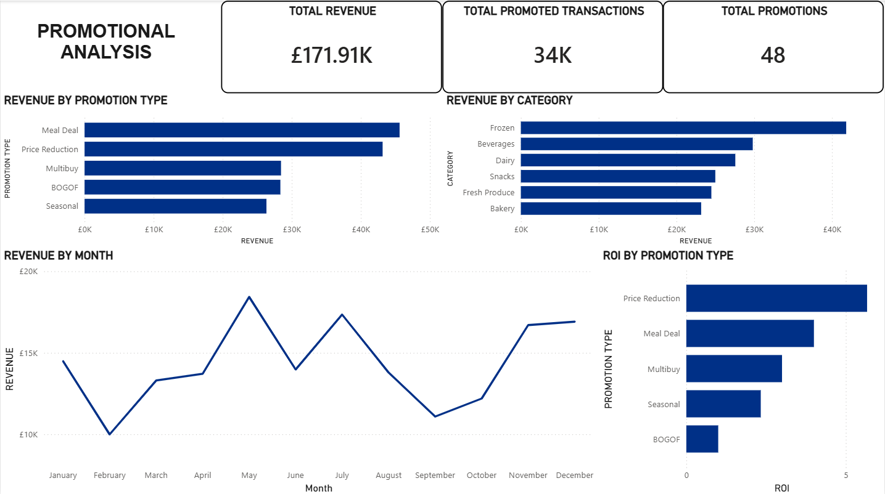
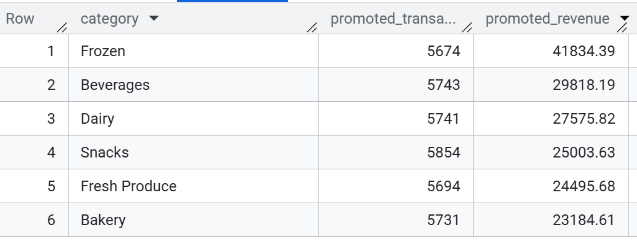
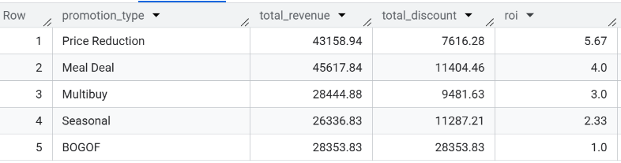
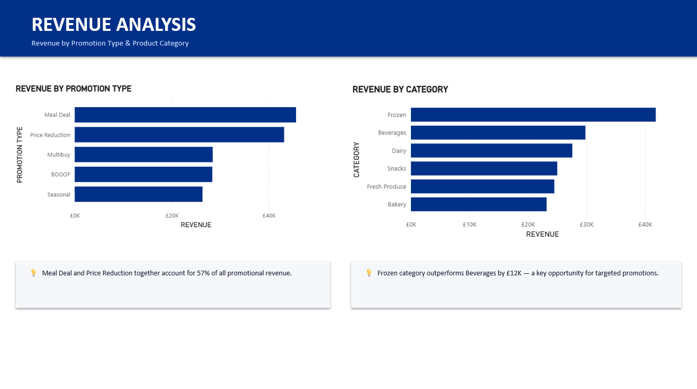

# Promotional Performance Analysis

An end-to-end data analytics project analysing promotional activity across a UK retail grocery network. Built to demonstrate the full analyst workflow — from SQL-based exploratory analysis through to a Power BI dashboard and a stakeholder-ready PowerPoint report.

---

## Business Questions

1. Which promotion types drove the most revenue?
2. Which product categories respond best to promotions?
3. Are there seasonal patterns in promotional performance?
4. Which promotion types deliver the best ROI?

---

## Project Structure

```
Project 4 - Promotional Performance Analysis/
│
├── Datasets/
│   ├── fact_sales.csv        # 109,553 transactional sales records (2026)
│   ├── dim_product.csv       # 30 products across 6 categories
│   └── dim_promotion.csv     # 48 promotions across 5 promotion types
│
├── promo_analysis.pbix       # Power BI dashboard
├── promotional_analysis.pptx # Stakeholder presentation
└── README.md
```

---

## Dataset

| Table | Rows | Key Fields |
|---|---|---|
| fact_sales | 109,553 | sale_date, product_id, promotion_id, revenue, is_promoted |
| dim_product | 30 | product_name, category, base_price |
| dim_promotion | 48 | promotion_type, discount_pct, start_date, end_date |

**Categories:** Beverages, Snacks, Dairy, Frozen, Fresh Produce, Bakery

**Promotion Types:** Meal Deal, Price Reduction, Multibuy, BOGOF, Seasonal

---

## SQL Analysis (BigQuery)

**1. Data validation**
```sql
SELECT
  COUNT(*) AS total_rows,
  COUNTIF(is_promoted = 1) AS total_promoted,
  ROUND(SUM(revenue), 2) AS total_revenue
FROM `promo_analysis.fact_sales`
```

**2. Revenue by promotion type**
```sql
SELECT
  p.promotion_type,
  ROUND(SUM(f.revenue), 2) AS total_revenue
FROM `promo_analysis.fact_sales` AS f
INNER JOIN `promo_analysis.promotion` AS p
ON f.promotion_id = p.promotion_id
GROUP BY p.promotion_type
ORDER BY total_revenue DESC
```

**3. Revenue by product category**
```sql
SELECT
  pr.category,
  COUNT(*) AS promoted_transactions,
  ROUND(SUM(f.revenue), 2) AS promoted_revenue
FROM `promo_analysis.fact_sales` AS f
INNER JOIN `promo_analysis.product` AS pr ON f.product_id = pr.product_id
WHERE f.is_promoted = 1
GROUP BY pr.category
ORDER BY promoted_revenue DESC
```

**4. Seasonal trends by month**
```sql
SELECT
  EXTRACT(MONTH FROM sale_date) AS month_no,
  FORMAT_DATE('%B', sale_date) AS month,
  ROUND(SUM(revenue), 2) AS total_revenue
FROM `promo_analysis.fact_sales`
WHERE is_promoted = 1
GROUP BY EXTRACT(MONTH FROM sale_date), FORMAT_DATE('%B', sale_date)
ORDER BY month_no
```

**5. ROI by promotion type**
```sql
SELECT
  p.promotion_type,
  ROUND(SUM(f.revenue), 2) AS total_revenue,
  ROUND(SUM(f.revenue / (1 - f.discount_applied_pct/100) - f.revenue), 2) AS total_discount,
  ROUND(SUM(f.revenue) / NULLIF(SUM(f.revenue / (1 - f.discount_applied_pct/100) - f.revenue), 0), 2) AS roi
FROM `promo_analysis.fact_sales` AS f
INNER JOIN `promo_analysis.promotion` AS p ON f.promotion_id = p.promotion_id
GROUP BY p.promotion_type
ORDER BY roi DESC
```

---

## Key Findings

| Finding | Detail |
|---|---|
| Highest revenue | Meal Deal — £45.6K |
| Best ROI | Price Reduction — 5.67 (£5.67 revenue per £1 discount) |
| Top category | Frozen — £41.8K promoted revenue |
| Peak months | May, July, November, December |
| Lowest ROI | BOGOF — 1.2 |

---

## Power BI Dashboard

Single-page dashboard built on a star schema (fact_sales → dim_product, dim_promotion):

- Revenue by promotion type (bar chart)
- Revenue by product category (bar chart)
- Promoted revenue by month (line chart)
- ROI by promotion type (bar chart)
- KPI cards: Total Promoted Revenue, Total Promoted Transactions, Total Promotions

---

## Recommendations

1. **Prioritise Price Reduction** — highest ROI at 5.67; increase frequency across Frozen and Beverages
2. **Review BOGOF** — lowest ROI at 1.2; evaluate whether volume gains justify the deep discount
3. **Concentrate spend in May, July, and Q4** — peak promotional periods with strongest revenue return
4. **Focus on Frozen & Beverages** — top two categories by promoted revenue; develop category-specific plans

---

## Screenshots

**Power BI Dashboard**


**SQL Query Results**




**PowerPoint Report**


---

## Tools & Skills

| Tool | Usage |
|---|---|
| BigQuery (SQL) | Data validation, aggregation, JOINs, ROI calculation |
| Power BI | Dashboard design, star schema data model |
| PowerPoint | Stakeholder report with findings and recommendations |
